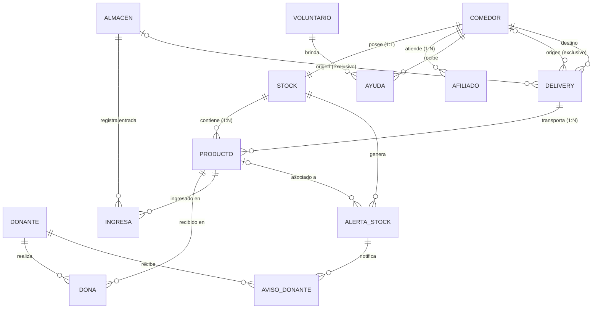

# 🚚 Sistema de Gestión y Logística Automática de Red de Comedores Comunitarios

Un sistema integral de base de datos relacional diseñado en **T-SQL (SQL Server)** para la administración, control de inventario y redistribución logística automatizada de insumos entre comedores comunitarios y almacenes centrales.

## 🌟 Características Principales

* **Logística Automática de Auxilio (`usp_Logistica_AuxilioAutomatico`):** Detección automática cuando un comedor cae por debajo de su stock mínimo. Aplica una regla de auxilio zonal (red solidaria comedor a comedor priorizando productos próximos a vencer) con *fallback* automático al Almacén Central.
* **Sistema de Triggers en Cascada:**
  * `TR_Control_Stock_Bajas`: Dispara alertas críticas y la rutina logística al eliminar o consumir insumos.
  * `TR_Vencimiento_Proximo`: Detecta y alerta sobre productos con vencimiento en un margen ≤ 30 días.
  * `TR_Aviso_Donantes_Stock_Bajo`: Notifica automáticamente a los donantes registrados ante faltantes críticos.
* **Índice de Urgencia Ponderado (`VW_Ranking_Necesidad_Comedores`):** Algoritmo en vista relacional que calcula el nivel de necesidad de cada sede combinando el déficit real con la prioridad del comedor (Alta, Media, Baja) segun edades de afiliados.
* **Demografía de Afiliados:** Control de beneficiarios únicos por DNI con cálculo dinámico de edad (`FN_Calcular_Edad`) para segmentación de niños (<12 años) y adultos mayores (>60 años).

## 🛠️ Tecnologías Utilizadas

* **Motor de DB:** Microsoft SQL Server (Transact-SQL / T-SQL)
* **Objetos Implementados:** Triggers (AFTER INSERT/DELETE), Stored Procedures, Views, Constraints y Relaciones 1:1, 1:N y N:N.

## 🗂️ Estructura del Modelo (DER)

